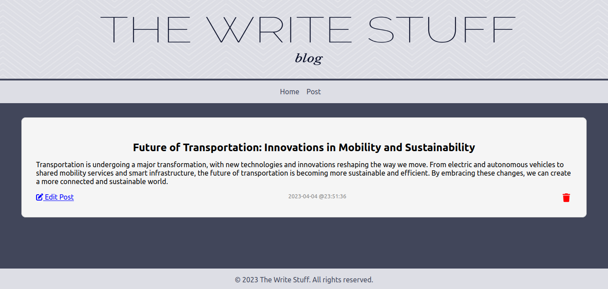
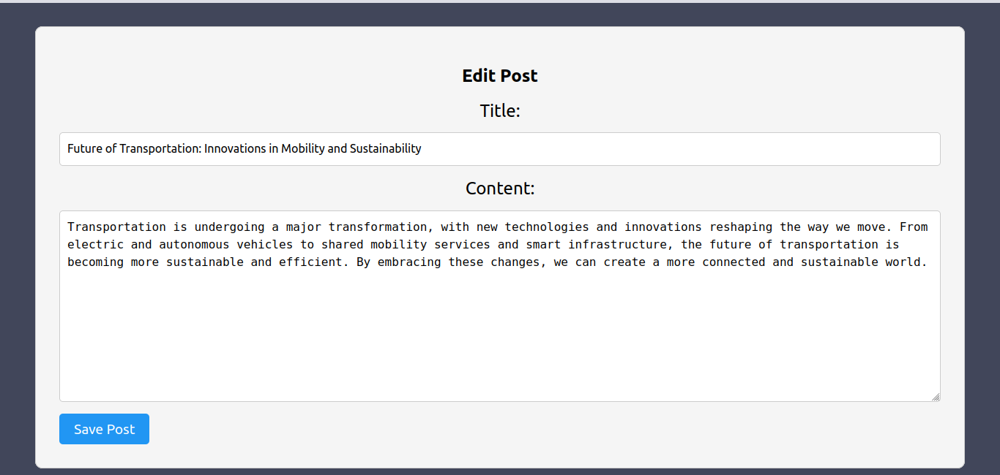
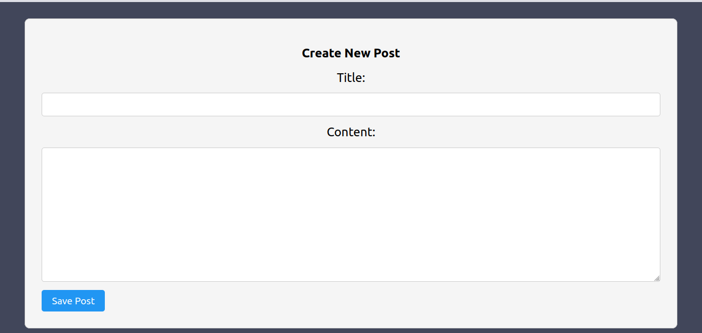

<h1> CRUD React Blog Site</h1>

This is a simple blog-like site where one can view, create, edit, and delete blog posts. The site is built using React and JavaScript for the front-end and PHP for the API was built using PHP and SQL for the database.

<h2><u> Blog Pages </u></h2>

Landing/home:


- The page displays all the posts stored in the database, sorted from newest to oldest.
- A snippet of each post content is shown, with an option for the user to view the full post by clicking a "View More" button.
- The "Home" navigation link redirects the user back to the same page.
- The "Post" navigation link redirects the user to the page for creating a new post.

Viewing single post:



- The page displays the full content of a single post.
- User can has option to edit or delete the post

Editing post:



- If edit option is selected site navigates to a pre populated form with post values and allows user to make changes and save changes made
- Once the changes are made, the user can save the changes.

Creating a new post:



- When the "Post" option is selected in the navigation bar, the user is directed to the "create post" form.
- The form is initially empty, allowing the user to enter information for a new blog post.
- Once the user has entered the post information, they can click the "Save Post" button to create the new post.
- After the post is saved, the page will automatically navigate to the main page, where the new post will be displayed at the top of the list.

Deleting a post:

- When the user clicks the delete icon on the edit post page, the post will be deleted.
- The page will then automatically navigate to the home page, where all posts are displayed.
- The deleted post will no longer be displayed on the home page.

<h2><u> Running the React Front-end </u></h2>

1. Open a terminal and navigate to the front_end portion of the project.
2. Run npm install to install all required dependencies.
3. Once the installation is complete, run npm start to start the development server.
4. The React front-end should now be running on http://localhost:3000/. Open your web browser and navigate to this URL to view the app.

Note: Before running the React front-end, ensure that the back-end server is already running.

<h2><u> API Endpoints </u></h2>

- Base URL: http://localhost/react-blog/api/index.php

| HTTP Method | Endpoint                  | Description                      |
| ----------- | ------------------------- | -------------------------------- |
| GET         | /posts                    | Get all blog posts               |
| GET         | /post?post_id={id}        | Get a specific blog post by ID   |
| POST        | /add_post                 | Create a new blog post           |
| PUT         | /edit_post?post_id={id}   | Edit an existing blog post by ID |
| DELETE      | /delete_post?post_id={id} | Delete a blog post by ID         |

<h2><u> Request and Response Formats </u></h2>

<b> Create a new post </b>

Request:

```json
{
  "title": "Add post title here",
  "content": "Add post content here",
  "post_date": "2022-01-01",
  "post_time": "08:00:00"
}
```

Response:

```json
{
  "message": "Record created successfully"
}
```

<b> Edit an existing post </b>

Request:

```json
{
  "post_id": 1,
  "title": "Add post title here",
  "content": "Add post content here",
  "post_date": "2022-01-01",
  "post_time": "08:00:00"
}
```

Response:

```json
{
  "message": "Record created successfully"
}
```

<h2><u> How to use the API </u></h2>

1. Clone the react_blog project repository into your web server's document root directory.
   - For Ubuntu: **/opt/lampp/htdocs/**
   - For Windows: **C:\xampp\htdocs\\**
   - For macOS: **/Applications/XAMPP/xamppfiles/htdocs/**
2. Navigate to the database folder in the cloned project directory and locate the database file. You have the option of using either the blog.csv or blog.sql file, depending on your preference.
3. Import the chosen database file into your MySQL database server.
4. Check that your Apache server and MySQL database are started.
5. You can now start using the API by sending requests to the above endpoints.
